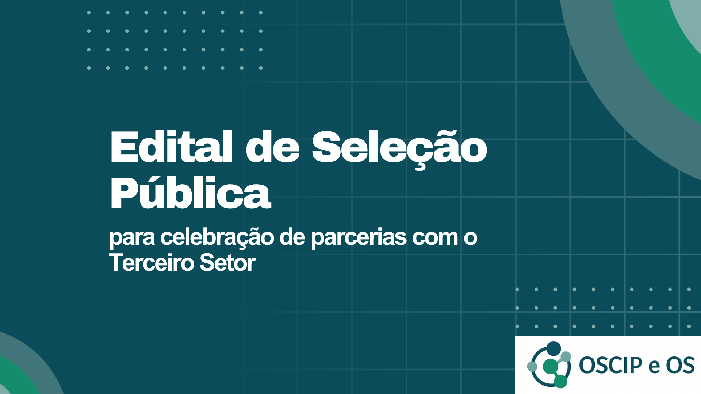

# ***Seleções Públicas para celebração de Parcerias***

Damos boas vindas à capacitação sobre **Seleções Públicas** para parcerias com o terceiro setor!

## **Início da Jornada**

- ### *Porque esse curso é relevante?*

Este curso tem como objetivo capacitar servidores e gestores públicos estaduais para planejar, implementar, conduzir e acompanhar processos de seleção pública voltados à celebração de parcerias com organizações da sociedade civil, em conformidade com a Lei Estadual nº 23.081/2018 e suas regulamentações, isto é, os Decretos Estaduais nº 47.553/2018, nº 47.554/2018 e nº 47.742/2019. Por isso, este curso é relevante porque:

- 📚 **Fortalece a capacidade institucional** do Estado de Minas Gerais para celebrar parcerias com mais segurança, eficiência, qualidade e transparência.

- 📚 **Garante conformidade legal**, alinhando os gestores e órgãos à Lei Estadual nº 23.081/2018 e seus regulamentos.

- 📚 **Qualifica a gestão pública**, instruindo o uso dos modelos da SEPLAG e evitando fragilidades na elaboração dos editais, bem como de seus termos de referência, critérios de avaliação e programas de trabalho, que podem gerar custos, atrasos ou mesmo inviabilizar parcerias.

- 📚 **Promove maior impacto social**, já que uma seleção bem estruturada aumenta a chance de escolher organizações da sociedade civil mais preparadas para executar políticas públicas com qualidade.

- 📚 **Aumenta a transparência e a confiança pública**, pois processos seletivos claros e bem conduzidos reduzem riscos de desvios legais, questionamentos por ógãos de controle e desconfiança da sociedade.

- 📚 **Contribui para resultados concretos**, estimulando parcerias mais eficazes e melhorando a execução de serviços de interesse público em diversas áreas.

- ### *Para quem é esse curso:*
Esse curso é para você que:

:white_check_mark: Está envolvido com a **celebração de termos de parceria ou contratos de gestão**.
{ .card }

:white_check_mark: É novato, ou até mesmo experiente, com **projetos de parceria entre o governo e entidades do terceiro setor**.
{ .card }

:white_check_mark: Quer **organizar** o processo de seleção pública de parceiros de forma mais **qualificada e eficiente**.
{ .card }

:white_check_mark: Precisa **orientar e colaborar** com outras pessoas ou equipes técnicas neste processo.
{ .card }

- ### *O que você vai aprender:*

Ao final deste curso, você será capaz de:

- 💡 Compreender o marco legal que regula as parcerias com Oscips e OSs em Minas Gerais, com destaque para a Lei Estadual nº 23.081/2018 e regulametos.

- 💡 Apontar a viabilidade da celebração de parcerias como forma de execução de políticas públicas, identificando riscos e oportunidades.

- 💡 Planejar e realizar todas as fases de um processo de seleção pública, desde a elaboração até a convocação da entidade vencedora.

- 💡 Utilizar o SEI (Sistema Eletrônico de Informações) como ferramenta de tramitação processual neste caso.

- 💡 Elaborar o edital de seleção pública com base no modelo SEPLAG, definindo corretamente objeto, valor, vigência, condições de participação, prazos, recursos, etc.; além de construir anexos fundamentais como termo de referência, critérios de avaliação de propostas, programa de trabalho e demais documentos obrigatórios.

- 💡 Aplicar boas práticas de gestão que assegurem a legalidade, a transparência e a eficiência na escolha de parceiros do terceiro setor.

- 💡 Prevenir erros e irregularidades, conhecendo pontos de atenção mais frequentimente identificados.

- 💡 Contribuir para o monitoramento e avaliação mais efetivos das parcerias, delineando produtos e indicadores de execução, resultado e impacto.

## **Como funciona:**
O curso é dividido em 9 aulas de conteúdo com:

- Vídeo aulas objetivas;
- Materiais disponibilizados;
- Tira-dúvidas por comentários ao final da página.

Você só precisa de cerca de 1 hora por aula para concluir cada etapa. Ou seja: com um pouquinho de dedicação, é possível finalizar o curso rapidamente.

## **Comece agora:**
Não há pré-requisitos, você só precisa disposição para apreender!

[Começar Agora!](aula_01/aula_01.md){ .md-button .md-button--primary }

